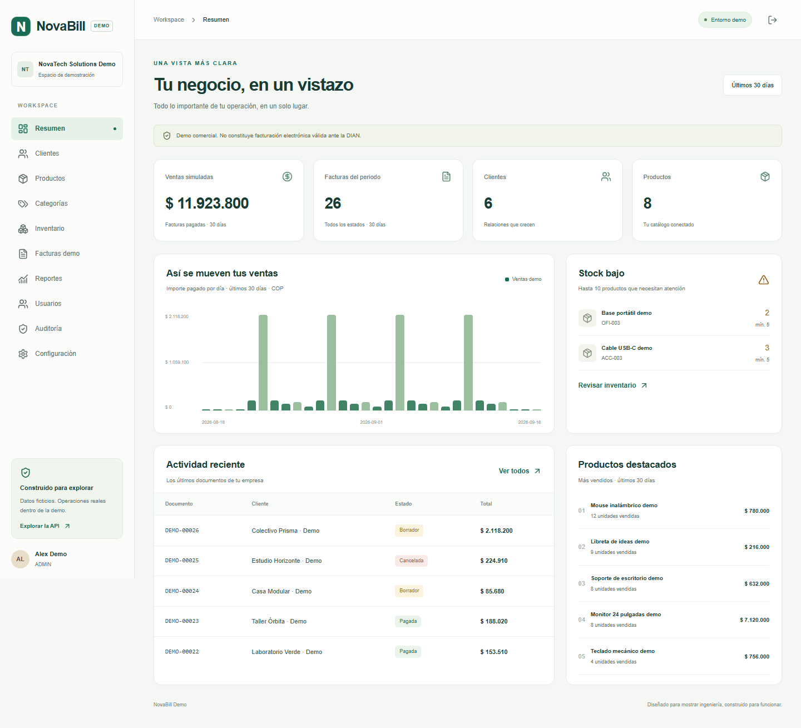
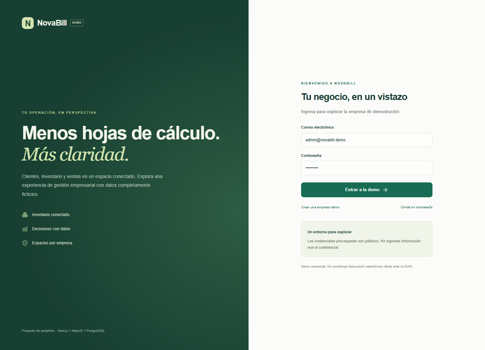
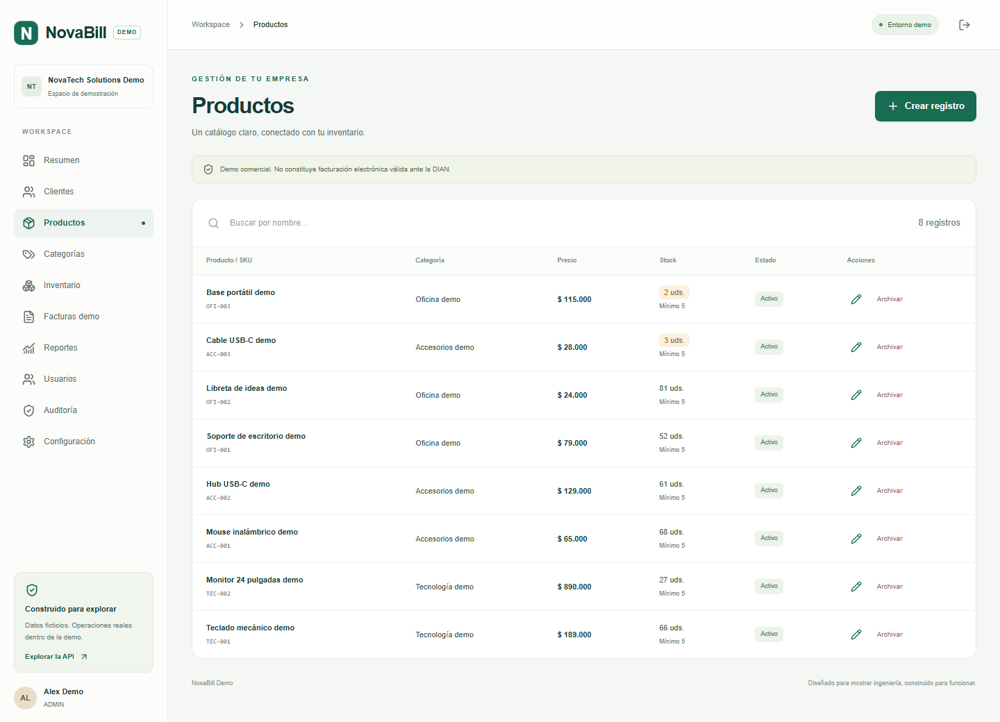
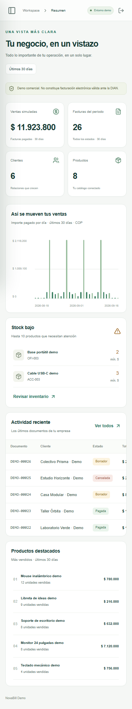
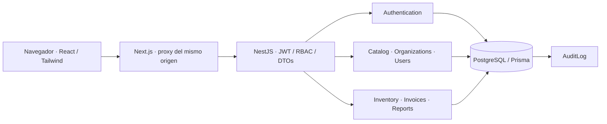

# NovaBill Demo

**Gestión empresarial con claridad. Una demo SaaS compacta, multiempresa y funcional.**

[](https://github.com/jhonatanMesa/JMesa-NovaBill-Demo/actions/workflows/ci.yml)

Proyecto de portafolio de [jhonatanMesa](https://github.com/jhonatanMesa). Demuestra arquitectura modular, seguridad, interfaz responsive y persistencia transaccional con una operación comercial ficticia de extremo a extremo.

> **Demo comercial. No constituye facturación electrónica válida ante la DIAN.**
> No hay integración fiscal, pagos reales, APIs privadas ni datos de clientes reales. Usa únicamente información ficticia. Las credenciales demo son públicas.

## Vista del producto



<details>
<summary>Ingreso, catálogo y vista móvil</summary>





</details>

## Qué puedes hacer

- Registrar una empresa ficticia con su administrador, iniciar sesión, consultar el perfil y cerrar las sesiones. Recuperación de contraseña explícitamente simulada.
- Gestionar usuarios y roles `ADMIN`, `SELLER`, `VIEWER`; desactivar usuarios y revocar sus sesiones.
- Crear, editar, buscar y paginar clientes y productos; archivar conservando historial. Organizar categorías, SKU, precios, estado y stock mínimo.
- Registrar entradas, salidas y ajustes con motivo e historial. Impedir stock negativo y detectar existencias bajas.
- Crear facturas internas con varios productos y precios calculados en servidor. Transiciones `DRAFT → PAID → CANCELLED` o `DRAFT → CANCELLED`. Pagar descuenta stock; cancelar una pagada lo devuelve una sola vez.
- Ver ventas de 30 días, facturas, clientes, productos, gráfico, actividad reciente y productos más vendidos.
- Filtrar reportes por fecha, cliente, producto y estado; exportar CSV DEMO; consultar auditoría.

## Ejecución rápida con Docker

Requisitos: Git, Node.js **22+**, Docker Engine con Compose v2 (o Docker Desktop).

```bash
git clone https://github.com/jhonatanMesa/JMesa-NovaBill-Demo.git
cd JMesa-NovaBill-Demo
npm run setup
docker compose up --build -d --wait
```

`setup` no requiere instalar dependencias: genera `.env` con contraseña PostgreSQL y clave JWT aleatorias. Nunca sobrescribe una configuración existente. Compose construye la aplicación, espera la base, aplica migraciones, ejecuta el seed y arranca API y web.

- Aplicación: [http://localhost:3000](http://localhost:3000)
- Swagger: [http://localhost:3000/api/docs](http://localhost:3000/api/docs)
- OpenAPI: [http://localhost:3000/api/docs-json](http://localhost:3000/api/docs-json)
- Health: [http://localhost:3000/api/health](http://localhost:3000/api/health)

| Acceso demo        | Valor                   |
| ------------------ | ----------------------- |
| Empresa            | NovaTech Solutions Demo |
| Administrador      | `admin@novabill.demo`   |
| Contraseña pública | `Demo1234!`             |

El seed carga 6 clientes, 8 productos, movimientos y 26 facturas ficticias. Repetirlo conserva los datos de una instalación ya inicializada. No hay un reset destructivo automático.

```bash
docker compose logs -f api web
docker compose stop
docker compose start
```

Los datos persisten en un volumen Docker. El frontend y PostgreSQL se publican solo en `127.0.0.1`; la API queda en la red interna. Antes de exponer una instancia en internet, revisa las [limitaciones de seguridad](docs/security.md).

## Desarrollo local

Puedes usar PostgreSQL 17+ propio o solo el servicio de base de datos de Compose:

```bash
npm ci
npm run setup
docker compose up -d db
npm run db:generate
npm run db:migrate
npm run db:seed
npm run dev:api
```

En otra terminal:

```bash
npm run dev:web
```

Con PostgreSQL propio, crea una base vacía y configura `DATABASE_URL` en `.env` antes de migrar. La API carga `.env` desde la raíz. Next.js usa por defecto `http://127.0.0.1:4000` para el proxy; si cambias ese destino, exporta `API_INTERNAL_URL` en la terminal de la web. El destino del proxy se fija al construir el frontend.

Para ejecutar los builds fuera de Docker:

```bash
npm run build
npm run start:api
# Otra terminal:
npm run start -w apps/web
```

## Variables de entorno

| Variable                                            | Uso                                                                                    |
| --------------------------------------------------- | -------------------------------------------------------------------------------------- |
| `DATABASE_URL`                                      | Conexión PostgreSQL de la API, migraciones y seed local. Compose usa el servicio `db`. |
| `POSTGRES_USER`, `POSTGRES_PASSWORD`, `POSTGRES_DB` | Inicialización de PostgreSQL en Docker.                                                |
| `JWT_SECRET`                                        | Clave aleatoria de al menos 48 caracteres; generada por `setup`.                       |
| `APP_ORIGIN`                                        | Origen permitido; por defecto `http://localhost:3000`.                                 |
| `API_PORT`                                          | Puerto local de API, por defecto `4000`.                                               |
| `API_INTERNAL_URL`                                  | Destino del proxy Next.js. Local: `http://127.0.0.1:4000`. Docker: `http://api:4000`.  |
| `COOKIE_SECURE`                                     | `false` solo para HTTP local; `true` al desplegar con HTTPS.                           |
| `DB_PORT`                                           | Opcional: puerto PostgreSQL publicado por Compose, por defecto `5432`.                 |

Consulta [.env.example](.env.example). Nunca publiques `.env` ni reutilices estas credenciales demo en otros servicios.

## Stack y arquitectura

Frontend **Next.js + React + TypeScript + Tailwind CSS**. API REST **NestJS** con DTOs validados y Swagger. Persistencia **PostgreSQL + Prisma**. Pruebas **Jest + Supertest + Playwright**. Infraestructura **Docker Compose + GitHub Actions**, ESLint y Prettier.



Monolito modular: tres módulos NestJS, servicios con reglas de negocio y Prisma como capa de acceso tipada. No introduce microservicios, colas, Redis ni una capa de repositorios que solo duplicaría Prisma. Un usuario pertenece a una empresa. El rol es un enum restringido; no hay un diseñador de permisos personalizado.

```text
apps/
  api/src/
    auth/             Sesiones y registro
    catalog/          Clientes, productos, categorías, empresa y usuarios
    billing/          Inventario, facturas, reportes y dashboard
    dto.ts            Validación y esquemas OpenAPI
    security.ts       Contraseñas, JWT, cookies, origen y roles
    database.ts       Prisma, transacciones y auditoría
  web/
    app/              App Router, layout y estilos
    components/       Workspace, formularios, dashboard y UI reutilizable
    lib/              Cliente HTTP, tipos y formato
prisma/               Esquema, migraciones y seed
tests/                Unitarias, integración y E2E
scripts/              Configuración local y escaneo previo al commit
docs/                 Arquitectura, datos, API, seguridad y evidencias
.github/workflows/    Calidad y E2E sobre Docker
```

Más detalles: [arquitectura](docs/architecture.md), [base de datos](docs/database.md), [API](docs/api.md), [seguridad](docs/security.md), [verificación](docs/verification.md).

## Pruebas y calidad

```bash
npm run lint
npm run typecheck
npm run format:check
npm test
npm run test:integration
npm run build
npm run check:secrets
npx playwright install chromium
npm run test:e2e
```

Integración requiere PostgreSQL migrado y `.env`; crea empresas ficticias aisladas, no elimina registros. E2E requiere web y API en ejecución y seed aplicado. `E2E_BASE_URL` permite cambiar la URL. No ejecutes estas pruebas contra datos reales.

CI instala con `npm ci`, genera Prisma, aplica migraciones, repite seed, verifica lint/tipos/formato/secretos, ejecuta Jest y build, construye Docker Compose y prueba sus contenedores con Playwright. Los reportes de fallo se conservan como artefactos de Actions.

## Seguridad implementada

- Organización obtenida de la sesión verificada, nunca de un campo enviado por el cliente. Relaciones compuestas impiden enlazar entidades de distintas empresas.
- RBAC por operación; usuarios desactivados y cambios de rol invalidan sesiones. Responses de usuario excluyen hashes y tokens.
- Contraseñas con scrypt y salt aleatorio. JWT de 15 minutos. Refresh aleatorio de un solo uso con digest SHA-256, vencimiento de 7 días y revocación.
- Cookies `HttpOnly`, `SameSite=Strict`, `Secure` configurable; sin tokens en localStorage. Origen estricto y cabecera propia en mutaciones para mitigar CSRF.
- DTOs rechazan propiedades extra, límites de cantidades e importes, CORS limitado, Helmet, rate limiting y errores centralizados sin stack ni datos internos.
- Stock y numeración serializados por empresa dentro de transacciones PostgreSQL. Auditoría escrita en la misma transacción que las mutaciones de negocio.
- CSV escapa contenido y neutraliza prefijos de fórmulas. Configuración privada excluida de Git y Docker.

## Límites deliberados

Demo de portafolio, no producto comercial listo para producción. No hay DIAN, facturación legal, cobros, correo, recuperación real, cambio de contraseña ni información privada. COP e impuestos simulados; cantidades enteras. Facturas inmutables salvo estado: si un borrador necesita cambios, cancélalo y crea otro. UI: hasta 10 líneas por factura; API: hasta 50. Exportación: hasta 5000 documentos; filtrar por producto devuelve el total de las facturas que lo contienen, no solo ese producto. Dashboard: últimos 30 días según fecha de creación UTC. El límite de solicitudes está en memoria y presupone una sola instancia API. Los correos de usuarios son únicos globalmente. Sin RLS, MFA, SSO, alta disponibilidad, backups gestionados ni pruebas de carga.

## Publicación desde un checkout nuevo

El repositorio público de esta entrega es `jhonatanMesa/JMesa-NovaBill-Demo`. Para un fork o destino vacío propio:

```bash
git init -b main
git add .
npm run check:secrets
git diff --cached --stat
git commit -m "Initial release: NovaBill SaaS Demo"
gh repo create TU_CUENTA/JMesa-NovaBill-Demo --public --source=. --remote=origin --push
```

Revisa los archivos preparados antes del commit. No ejecutes `gh repo create` si ese repositorio ya existe. Los checks de calidad y build deben pasar antes de publicar.

## Licencia

[MIT](LICENSE). Datos, marca y escenarios de ejemplo ficticios. No se incluye lógica comercial privada.
