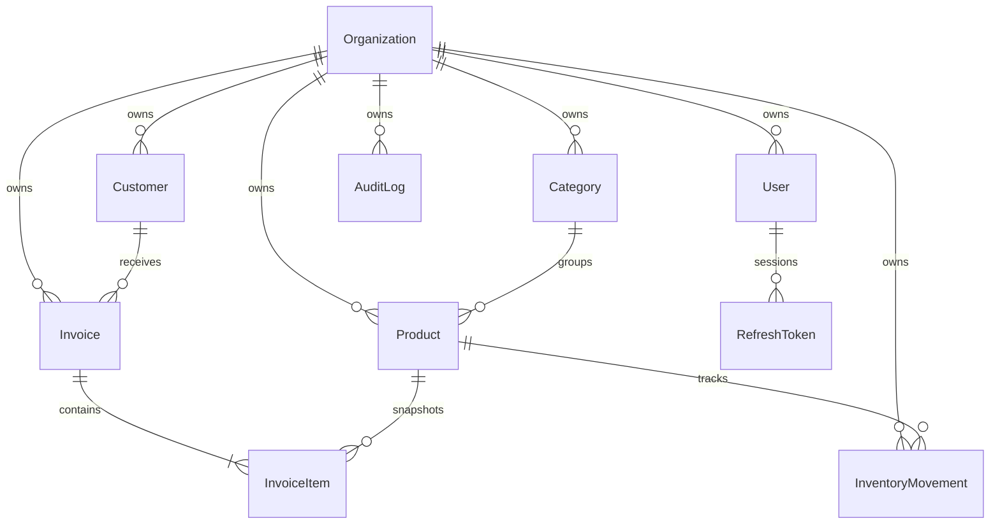

# Modelo de datos



`Role` es un enum PostgreSQL (`ADMIN`, `SELLER`, `VIEWER`), suficiente para permisos fijos de la demo. No existe una tabla editable de permisos.

## Aislamiento

Todas las entidades de negocio incluyen `organizationId`. Las claves foráneas compuestas `(organizationId, entityId)` impiden que una categoría, cliente o producto de otra empresa se vincule a un documento. Cada consulta pública añade el filtro de empresa autenticada. `User.email` es único globalmente: el login no requiere un selector de organización. Un usuario pertenece a una sola empresa.

Los identificadores son UUID. SKU, categoría y número de factura son únicos por empresa. Índices de empresa + fecha aceleran inventario/auditoría; empresa + estado/fecha y cliente cubren reportes. `RefreshToken.tokenHash` es único y se indexa por usuario/vencimiento.

## Historial y restricciones

Clientes y productos admiten `deletedAt`; se preservan líneas e historial. Productos requieren stock cero para archivarse. Usuarios se desactivan. Facturas se cancelan, no se borran; categorías se renombran. Timestamps en entidades mutables; movimientos, logs y líneas son append-only en la API. `actorId` se conserva como UUID en auditoría y movimientos, sin copiar datos personales ni credenciales.

Restricciones SQL verifican stock, precios, mínimos, impuesto simulado, numeración positiva y coherencia de importes. Las migraciones versionadas incluyen tablas, índices, relaciones y CHECK constraints; no se usa `db push` para la entrega.

## Operación

```bash
npm run db:generate
npm run db:migrate
npm run db:seed
```

El seed es para una instalación vacía: crea registros ficticios utilizando los servicios de negocio. Si existe `admin@novabill.demo`, no modifica nada. No pretende reparar una carga interrumpida ni resetear una demo compartida. Las pruebas crean empresas nuevas con correos `example.test` para no alterar la empresa de exhibición. No se incluye ni se publica un volcado de la base local.
